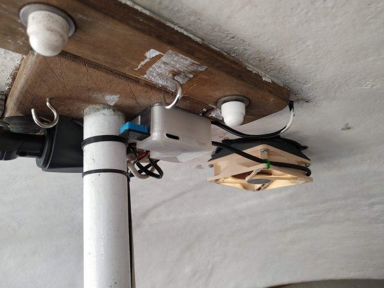

# Humidity and Temperature sensing fan controller for a small boat, with battery protector.
## By Owen.
#### My boat can get quite hot, suffers from condensation, and a permanent fan kept on flattening the battery.

A Small controller based on a Digispark ATTiny85 development board I have lying around and a spare DHT11 combined temperature and humidity sensor.
It turns the ventilator fan on and off (and several speeds in between) depending on the temperature, humidity, user input and battery state (voltage).

* [DigiSpark](https://digistump.com/wiki/digispark) Based
  * ATtiny85, plenty powerful enough for this application, and with a robust toolchain. It has 6 IO pins & very little extra cruft
  * Has a onboard 5v regulator, I can supply it with the battery voltage, and then power the DHT11 from the 5v line
  * Somewhat tricky to flash/develop for, Lack of a uart is a total pain during debug since BitBang serial emulators eat half the memory+
* DHT11 Temperature and Humidity sensor
  * Not the best sensor, something more accurate would be prefered, but this is what I have
  * A DHT22 would be an easy (plug and go) upgrade
* PWM fan control via a high-current logic-level NPN mosfet
  * I have a quiet but powerful (Noctuna) 12V PC case fan to run from this
* Battery voltage sensing for powersave and shutdown. My boat has a good battery and solar charging system, but the battery can still get low during use and late season.
* A button.. to allow on/off/quiet overrides, my bunk is 50cm from the fan and a quiet mode seems like a really good idea.

## Hardware
KiKad project files, Gerber files and the Case design files are all in this repository.

The circuit is very simple, there is a logic-level mosfet to drive the fan. I used a IRLZ14 for this but almost any logic-level mosfet will do, just make sure it can handle the *startup* current of your fan. If your fan is powerful you may need to add a heatsink to the mosfet and make sure heat from it does not affect the sensor.

The Digispark incorporates a 5V voltage regulator (LM7805), which only powers the ATTiny and the DHT11 sensor, the absolute maximum voltage this can handle is 35V, Digistump themselves recommend a maximum of 16V for the module. Please be careful when disconnecting batteries on boarts with solar/fixed charging systems, you may be able to spike the supply voltage enough to damage this. However; it is reasonably robust and may even work for a 24v systems, but no promises, and you will need to change the thresholds in the code ;-)

Here are some picture of my buildup; at this stage I had, *ahem*, forgotten to put a flyback diode in parallel to the fan. This could be a very bad idea if a high wind decides to spin the fan very fast. It is not visible in my pictures but I added a 1N4007 diode to the underside between the pins of the connector. The revised PCB now has this flyback diode onboard.

 

## Software
See the `BoatFanControl.ino` sketch in the `Software` folder. There are a number of other sketches in there that I used during development, you may find the `*Calibrate` scripts useful to verify your sensors and voltage divider.

The DigiStump boards definitions are [here](http://digistump.com/package_digistump_index.json), this needs to be added to the Boards URL list in the preferences dialog of the IDE. In the IDE, select `baoards -> Digistump AVR boards -> Digispark (16MHz, no USB)` for programming. The 'No USB' refers to clock speed alignment and is advised to keep the clock stable when not plugged into a USB port.

Please read the notes at the top of the main sketch, by default the Digispark runs the fan at 500Hz, this is possibly audible and might affect fan lifespan (the jury is out, I've seen people arguing both sides quite convincingly). In any case I decided to pump the [fan PWM frequency](https://digistump.com/wiki/digispark/tricks#how_to_increase_hardware_pwm_frequency) up as high as possible. But this requires modifying a file in the Digispark boards folder, proper details and URL's for reference are in the sketch header.

## Operation

* The controller takes a Temperature and Humidity reading every 20 seconds and then decides how to set fan based on the readings over the last 2 minutes.
* Power Control; the controller also reads the battery voltage and uses this to reduce battery drain when needed.
  * Vmin->11.8V : Powersave; no activity, but still wake every 20s to take and process a voltage reading. 
  * 11.8->12.5V : Low Power; fan is restricted to 33% power.
  * 12.5->Vmax  : Good Power; fan can rise to 100% power.
* Fan Control
  * The fan works on simple trigger values for temperature and humidity (28c and 70% respectively), the fan will start at 33% PWM power, and rise to 100% over the next four degrees temperature or 20% humidity. In low power mode the speed will never rise and remains at 30%
* Average readings; the last five readings are kept, the code discards any outliers before averaging the three middle values. This reduces any fast cycling and ignores the occasional 'way off' reading that DHT11's can occasionally produce (in my experience).
* User Control
  * The Button cycles: Full -> Quiet -> Off -> Full etc.. and the led flashes for feedback; two flashes for off, four for quiet and six for full.
  * Quiet mode is basically the same as Low power mode.
  * After three hours the User mode will change to the next higher power level, so that the button works more like a 3 hour 'sleep' function, it is not a on/off switch. I have an independently fused and switched line from my battery for this, and the mast head anchor light.
* The onboard LED flashes to indicate mode changes, errors, and when a sensor reading is made. It is dimmed in Quiet and Off modes.
  * If the unit continually flashes after startup then it is indicating a sensor disconnect or failure. 
  * During operation 10 very rapid flashes indicate a failed sensor reading.
* Testing is tricky due to lack of resources, serial debug is not practical due to memory and pin limitations. I found it best to test the sensors using the calibrate sketches. Then I ran on the testbench with much 'faster' timeouts (there is a option for this in the sketch), and my multimeters PWM (cycle and frequency) mode to check the output. I also used an identical sensor running on a Arduino Uno + a standard serial output DHT11 example to monitor the environment, and then spent time checking the results while breathing on sensors to trigger responses, and varying the voltage on my PSU.

## Low Power
If the battery is good and the fan is running then the power use is dominated by the fan (the mosfet is good to 6A).

But once the voltage drops to powersave levels it is desirable to have the controller draw minimal power to avoid flooring the battery.
* I use a low-power sleep mode between readings when the fan is off, this should reduce the load from the DigiSpark from a few milliamps to a few microamps. I dont have a meter sensitive enough to measure this with any accuracy.
* If you are serious about reducing power I also suggest replacing the R1/R2 (10K/1K) divider used for voltage sensing with a 470K/47K one, this reduces the power flow through them from 1.1 milliamps to 23 microamps at 12v.
* The DHT11 draws up to 2.5 milliamp when doing a reading and sending data, but should be under 100 microamps between readings. If I do a MK2 pcb I will power the DHT11 from the unused D4 pin (the ATtiny can supply enough power for this) and modify the code to switch it off between readings (nb: 250ms needed to recover when powered on).
