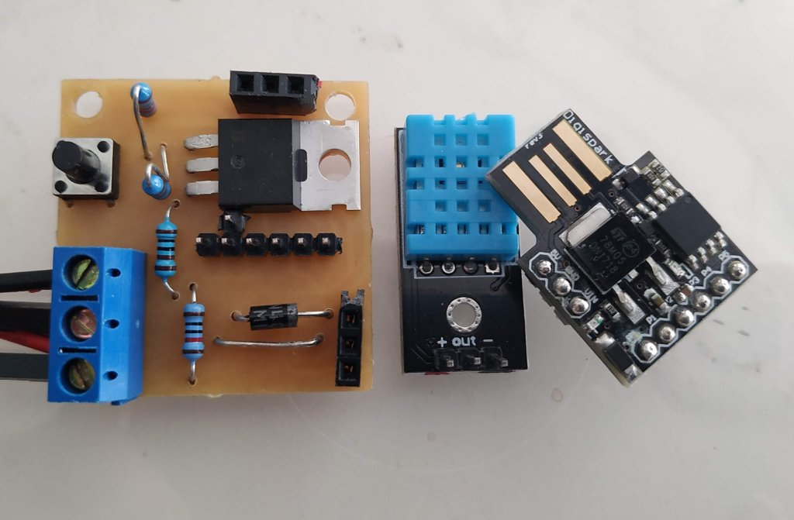

# Humidity sensor and fan controller for a small boat
## By Owen.

* DigiSpark Based
 * ATTiny 85
 * Has a onboard 5v regulator
 * 6 IO pins.. very little extra cruft
 * Somewhat tricky to flash/develop for, Lack of a uart is a total pain during debug.
* DHT11 Temperature and Humidity sensor
 * Not ideal, something more accurate would be prefered, but this is what I have.
* PWM fan control via a mosfet
* Battery voltage sensing for powersave and shutdown
* A button.. to allow on/off/quiet, etc.

#####Assembled:

Software is the next target; I have working sketches (see the `Code/` folder):
1. `VoltageCalibrate.ino` : Test and calibrate the Voltage sensor using USB-CDC serial to feedback.
2. `SensorReader.ino` : Test and relay readings from all sensors; 
 * Readings are sequentially flashed out in groups using a LED connected in place of the fan

These Sketches have verified my wiring and allowed me to verify the calibration of the resistor divider I use to sense the supply voltage.

My next stage is to define the main control loop; and implement it. 
* Testing will be tricky.. I'll need to 'fake it' somehow. 

Finally.. A box. And wiring it in.