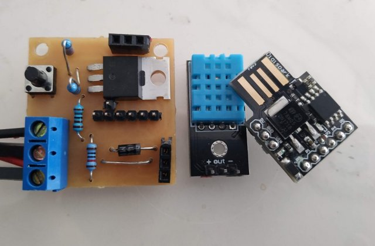
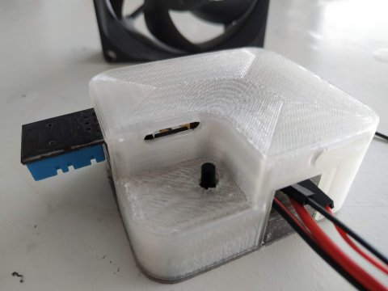
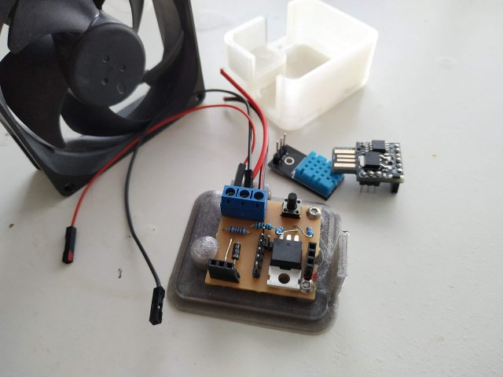

# Humidity sensor and fan controller for a small boat
## By Owen.
##### This is the plan..

A Small controller based on a Digispark ATTiny controller I have lying around and a ispare DHT11 combined temperature and humidity sensor.
Turns the Fan on and Off (and several speeds in between) depending on the temperature, humidity, user input and battery state (voltage).

* DigiSpark Based
  * ATtiny85, plenty powerful enough for this application, and with a robust toolchain. It has 6 IO pins & very little extra cruft
  * Has a onboard 5v regulator, I can supply it with the battery voltage, and I can power the DHT11 from the 5v line
  * Somewhat tricky to flash/develop for, Lack of a uart is a total pain during debug since BitBang serial emulators eat half the memory+
* DHT11 Temperature and Humidity sensor
  * Not ideal, something more accurate would be prefered, but this is what I have.
  * A DHT22 would be an easy (plug and go) upgrade
* PWM fan control via a high-current logic-level NPN mosfet
  * I have a quiet but powerful (Noctuna) 12V PC case fan to run from this
* Battery voltage sensing for powersave and shutdown
* A button.. to allow on/off/quiet overrides

#### Encased and Hardware complete

Case design (scad) and model files are in the repo.

# Code
See the 'BoatFanControl' script in the 'Software' folder.

* It takes one reading every 20S and then decides how to set fan.
* Power Control
  * Vmin->11.8V : Powersave mode; no activity, but still wake every 20s to take and process a voltage reading. 
  * 11.8->12.5V : Low Power Mode; fan is restricted to 30%
  * 12.5->Vmax  : Full power mode. fan can rise to 100%
* Fan Control
  * Is done on a simple Trigger value for temperature and humidity (28c and 70% respectively), the fan will start at 30% PWM power, and rise to 100% over the next four degrees temperature or 20% humidity. In low power mode the speed will never rise and remains at 30%
* User Control
  * The Button cycles: Full -> Quiet -> Off etc.. and flashes for feedback.
  * Quiet mode is Low power mode.
  * After three hours the mode will change to the next power level, the button is a 'sleep' function, not a on/off switch.
* Average readings; I keep five readings and discard outliers before averaging the three middle values.
* Testing is tricky. The code has an extensive debug mode for this.
* I'd like to use interrupts and have the controller sleep between readings/decisions, but for now I just delay(); power consumption is negligible like that, it does not register at all on the boats powermeter when the fan is off (and only 0.1A when the fan is full speed.)
