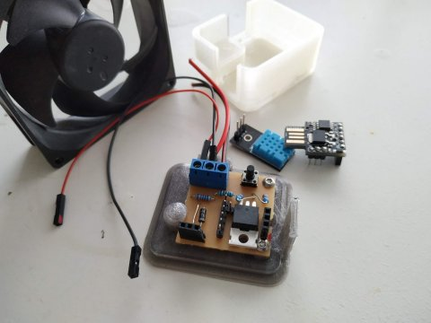

# Humidity sensor and fan controller for a small boat
## By Owen.
##### This is the plan..

A Small controller based on a Digispark ATTiny controller I have lying around and a ispare DHT11 combined temperature and humidity sensor.
Turns the Fan on and Off (and several speeds in between) depending on the temperature, humidity, user input and battery state (voltage).

* DigiSpark Based
  * ATtiny85, plenty powerful enough for this application, and with a robust toolchain. It has 6 IO pins & very little extra cruft
  * Has a onboard 5v regulator, I can supply it with the battery voltage, and I can power the DHT11 from the 5v line
  * Somewhat tricky to flash/develop for, Lack of a uart is a total pain during debug since BitBang serial emulators eat half the memory+
* DHT11 Temperature and Humidity sensor
  * Not ideal, something more accurate would be prefered, but this is what I have.
  * A DHT22 would be an easy (plug and go) upgrade
* PWM fan control via a high-current logic-level NPN mosfet
  * I have a quiet but powerful (Noctuna) 12V PC case fan to run from this
* Battery voltage sensing for powersave and shutdown
* A button.. to allow on/off/quiet overrides

#### Encased and Hardware complete

Case design (scad) and model files are in the repo.

Software is the next target; I have working sketches (see the `Code/` folder):
1. `VoltageCalibrate.ino` : Test and calibrate the Voltage sensor using USB-CDC serial to feedback
2. `SensorReader.ino` : Test and relay readings from all sensors; 
  * Readings are sequentially flashed out in groups using a LED connected in place of the fan

These Sketches have verified my wiring and confirmed the calibration of the resistor divider used to sense the battery voltage.

My next stage is to define the main control loop; and implement it. 
* Power Control
  * Vmin->11.8V : Powersave mode; no activity, wake every 30s to take and process a voltage reading. Ignore button
  * 11.8->12.6V : Low Power Mode(s); start running the fan; limit max speed. respect quiet/off overrides
  * 12.6->Vmax  : Full power mode. respect quiet/off overrides
* Testing will be tricky.. I'll need to 'fake it' somehow
* I'd like to use interrupts and have the controller sleep between readings/decisions.

Finally.. Mounting the Fan. Wiring it in. And Kill the power LED on the DigiSpark (there is a track you can cut).
